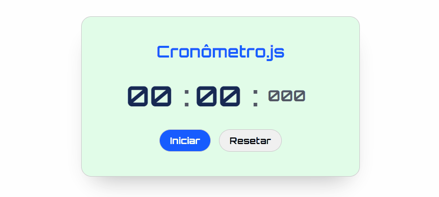

# Cronômetro com JS

## Objetivo

- Construir um cronômetro utilizando a tríade do frontend HTML, CSS e JS. 

## Screenshot

[]


## Tecnologias utilizadas

- HTML;
- CSS;
- Javascript

### O que aprendi

 - Posicionar os elementos na tela;
 - Utilizar fontes externas
 - Trabalahar com as propriedades do Display Flex;
 - Manipular o DOM através do JS;
 - Construir funções em JS.


### Como utilizar

1 - Clone para o projeto

```
git@github.com:ederhscc/cronometro-com-js.git
```